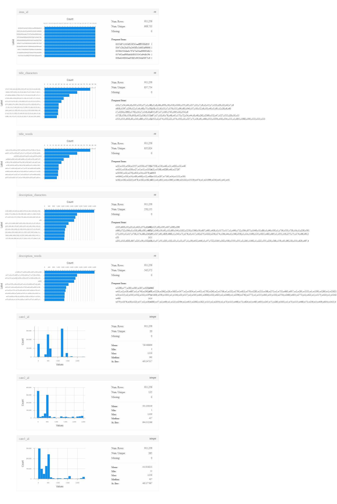

# seedcup2018

[主页](https://uniqueai.me/seedcup2018/)

[主要参考](https://github.com/wabyking/TextClassificationBenchmark)

关于[种子杯复赛](http://rank.dian.org.cn/static/index.html)的代码, 总行数200行左右

暂时没有训练数据

## 记号

`typedef pandas.DataFrame df`

## env prerequisite

+ 不限平台
+ python 3.*(以下没有特别说明,均为2018-10最新)

  + pandas
    + numpy
  + sklearn
  + pytorch(pytorch-cpu allowed)
    + torchtext
  + gensim

## data view

## directory

    ├── answerlastlong.txt  预测后的文件
    ├── config.py           主要配置文件
    ├── data                处理后的数据;运行datahelper后生成的文件
    │   ├── test_w.tsv      测试集
    │   ├── train_w.tsv     训练集
    │   ├── val_w.tsv       验证集
    │   └── w300.txt        词向量模型
    ├── datahelper.py       预处理数据
    ├── main.py             主程序
    ├── model\              所使用的模型
    ├── doc\                比赛说明文档及报告
    ├── raw\                比赛方提供的数据
    ├── train.py            提供训练代码支持
    ├── util.py             提供数据处理支持
    └── ...                 其他文件

## how to run

generate processed data in `data/` (need data in `raw/`)
>`py datahelper.py` 

suppose you want to save model in  `abc` dir

>`py main.py abc`

finally it will generate predicate `txt` for `raw\test_b.txt`

### load model and train

in `config.py`

change para `LAST_EPOCH`  ; and `LOADMODEL` to where the model saved

>`py main.py abc`

### modify answer manual

use ipython to run `main.py`

after run
>`ans = util.get_pred_list(model, test_iter, use_pandas=True)`

you will get a `df` ans

## model parameters

name | usage
--|--
MAX_EPOCH | num of train epoch
BATCH_SIZE=640  | usage 1G GPU when set to 64
MAX_SEQ_LEN=200 | fixed and max length of word
NUM_LAYER=2 | num of recurrent layers, stacking two LSTM together to form a stacked LSTM, with the second LSTM taking in outputs of the first LSTM and computing the final results.
DROPOUT | dropout probability of Dropout layer
wei_criterion | used to calculate total loss

others refer to `config.py`

## interface

func    |usage
--|--
get_pred_list | get predict for  buck_iter, return `2dlist`
get_pred_pd   | get predict for  buck_iter, return `pd`
creterion_val | input `2dlist` or `df`, return the score in validset